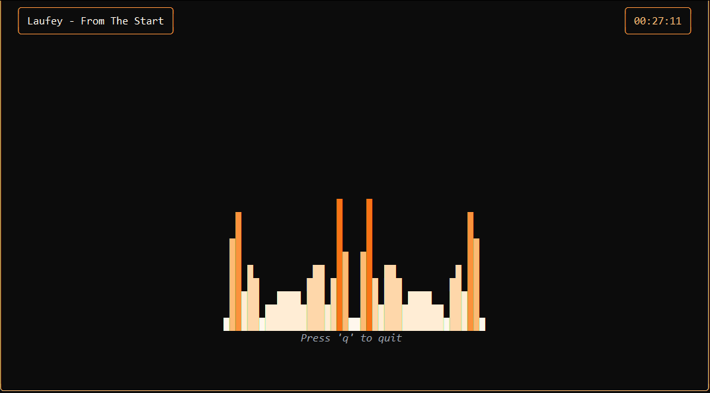

# Go TUI Music Visualizer



A terminal-based music visualizer written in Go, featuring a reactive spectrum analyzer, media title detection, and a clock.

## 1. System Requirements
You need the **PortAudio** C library installed on your system.
* **macOS:** `brew install portaudio`
* **Linux (Ubuntu/Debian):** `sudo apt-get install libportaudio2 libportaudio-cpp0 portaudio19-dev`
* **Windows:** Install via MSYS2 or ensure the DLL is in your path.

## 2. Installation
Initialize a module and get the dependencies:

```bash
go mod init visualizer
go get [github.com/charmbracelet/bubbletea](https://github.com/charmbracelet/bubbletea)
go get [github.com/charmbracelet/lipgloss](https://github.com/charmbracelet/lipgloss)
go get [github.com/gordonklaus/portaudio](https://github.com/gordonklaus/portaudio)
go get [github.com/mjibson/go-dsp/fft](https://github.com/mjibson/go-dsp/fft)
````

## 3. Run

```bash
go run main.go
```

## Controls

  * **Q / Esc / Ctrl+C**: Quit
  * **Resize Terminal**: The UI adapts automatically.

## Troubleshooting

If you see an error like `pkg-config: exec: "pkg-config": executable file not found`, install `pkg-config` via your package manager.
